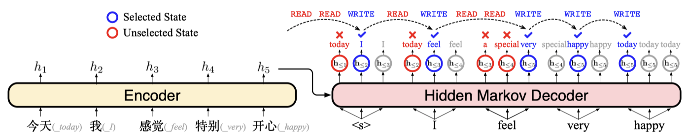

# Hidden Markov Transformer for Simultaneous Machine Translation

> **[Shaolei Zhang](https://zhangshaolei1998.github.io/), Yang Feng**

Source code for our ICLR 2023 spotlight paper "[Hidden Markov Transformer for Simultaneous Machine Translation](https://openreview.net/forum?id=9y0HFvaAYD6)"



Our method is implemented based on the open-source toolkit [Fairseq](https://github.com/pytorch/fairseq).

## Requirements and Installation

- Python version = 3.6

- [PyTorch](http://pytorch.org/) version = 1.7

- Install fairseq:

  ```bash
  git clone https://github.com/ictnlp/HMT.git
  cd HMT
  pip install --editable ./
  ```


## Quick Start

Since the training time of HMT on WMT15 De-En is slightly longer, we provide the trained HMT model of WMT15 De-En for reproduction. The corresponding Fairseq binary data of WMT15 De-En can be download [here](https://pan.baidu.com/s/1Z8GcwKtlzybyHN2rMIqSlQ?pwd=pvut). You can go directly to the inference part to test HMT, with the provided checkpoints and binary data.

| L    | K    | Download Link                                                |
| ---- | ---- | ------------------------------------------------------------ |
| -1   | 4    | [[百度网盘 Baidu Skydisk](https://pan.baidu.com/s/12kJATrGczEVO5Iy4m2m_iA?pwd=zsl1)] |
| 2    | 4    | [[百度网盘 Baidu Skydisk](https://pan.baidu.com/s/1GgwoxcwW4_q-c8gG7lkW5g?pwd=bdk6)] |
| 3    | 6    | [[百度网盘 Baidu Skydisk](https://pan.baidu.com/s/1nYxLOfclpQc3IAKz58z7Og?pwd=s1ni)] |
| 5    | 6    | [[百度网盘 Baidu Skydisk](https://pan.baidu.com/s/1lX6vFZHmH4N8e3u1r80cJQ?pwd=pdyk)] |
| 7    | 6    | [[百度网盘 Baidu Skydisk](https://pan.baidu.com/s/1L_1ztVDtWyvTTDYmvjjO8Q?pwd=1gue)] |
| 9    | 8    | [[百度网盘 Baidu Skydisk](https://pan.baidu.com/s/1jHatSwFdPPeaxjRHWZdgRw?pwd=trby)] |
| 11   | 8    | [[百度网盘 Baidu Skydisk](https://pan.baidu.com/s/1ptMUd3iuveTcYN6BuBd0tw?pwd=rw86)] |


### Data Pre-processing

We use the data of IWSLT15 English-Vietnamese (download [here](https://nlp.stanford.edu/projects/nmt/)) and WMT15 German-English (download [here](https://www.statmt.org/wmt15/)).

For WMT15 German-English, we tokenize the corpus via [mosesdecoder/scripts/tokenizer/normalize-punctuation.perl](https://github.com/moses-smt/mosesdecoder) and apply BPE with 32K merge operations via [subword_nmt/apply_bpe.py](https://github.com/rsennrich/subword-nmt). Follow [preprocess scripts](https://github.com/Vily1998/wmt16-scripts) to perform tokenization and BPE.

Then, we process the data into the fairseq format, adding `--joined-dictionary` for WMT15 German-English:

```bash
SRC=source_language
TGT=target_language
TRAIN=path_to_train_data
VAIILD=path_to_vaild_data
TEST=path_to_test_data
DATAFILE=dir_to_data

# add --joined-dictionary for WMT15 German-English
fairseq-preprocess --source-lang ${SRC} --target-lang ${TGT} \
    --trainpref ${TRAIN} --validpref ${VAIILD} \
    --testpref ${TEST}\
    --destdir ${DATAFILE} \
    --workers 20
```

### Training

Train the HMT with the following command:

- `--first-read`: low boundary $L$ in hidden Markov Transformer
- `--cands-per-token`: state number $K$ in hidden Markov Transformer

```bash
export CUDA_VISIBLE_DEVICES=0,1,2,3,4,5,6,7

MODELFILE=dir_to_save_model
DATAFILE=dir_to_data

FIRST_READ=3
CANDS_PER_TOKEN=6

python train.py --ddp-backend=no_c10d ${DATAFILE} --arch transformer --share-all-embeddings \
 --optimizer adam \
 --adam-betas '(0.9, 0.98)' \
 --clip-norm 0.0 \
 --lr 5e-4 \
 --lr-scheduler inverse_sqrt \
 --warmup-init-lr 1e-07 \
 --warmup-updates 4000 \
 --dropout 0.3 \
 --encoder-attention-heads 8 \
 --decoder-attention-heads 8 \
 --criterion label_smoothed_cross_entropy \
 --label-smoothing 0.1 \
 --left-pad-source False \
 --save-dir ${MODELFILE} \
 --first-read ${FIRST_READ} \
 --cands-per-token ${CANDS_PER_TOKEN} \
 --max-tokens 4096 --update-freq 1 \
 --max-target-positions 200 \
 --skip-invalid-size-inputs-valid-test \
 --fp16 \
 --save-interval-updates 1000 \
 --keep-interval-updates 300 \
 --log-interval 10
```

### Inference

Evaluate the model with the following command:

- Note that simultaneous machine translation require `--batch-size=1`with `--sim-decoding`.

```bash
export CUDA_VISIBLE_DEVICES=0
MODELFILE=dir_to_save_model
DATAFILE=dir_to_data
REF=path_to_reference

# average last 5 checkpoints
python scripts/average_checkpoints.py --inputs ${MODELFILE} --num-update-checkpoints 5 --output ${MODELFILE}/average-model.pt 

# generate translation
python generate.py ${DATAFILE} --path ${MODELFILE}/average-model.pt --batch-size 1 --beam 1 --left-pad-source False --fp16  --remove-bpe --sim-decoding > pred.out

grep ^H pred.out | cut -f1,3- | cut -c3- | sort -k1n | cut -f2- > pred.translation
multi-bleu.perl -lc ${REF} < pred.translation
```

- For decoding efficiency, we also provide a parallel generating version. The results are consistent with sim-decoding.

```shell
# generate translation
python generate.py ${data} --path $modelfile/average-model.pt --batch-size 250 --beam 1 --left-pad-source False --fp16  --remove-bpe > pred.out
```

## Our Results

The numerical results on IWSLT15 English-to-Vietnamese with Transformer-Small:

|  L   |  K   |  CW  |  AP  |  AL  |  DAL  | BLEU  |
| :--: | :--: | :--: | :--: | :--: | :---: | :---: |
|  1   |  2   | 1.15 | 0.64 | 3.10 | 3.72  | 27.99 |
|  2   |  2   | 1.22 | 0.67 | 3.72 | 4.38  | 28.53 |
|  4   |  2   | 1.24 | 0.72 | 4.92 | 5.63  | 28.59 |
|  5   |  4   | 1.53 | 0.76 | 6.34 | 6.86  | 28.78 |
|  6   |  4   | 1.96 | 0.83 | 8.15 | 8.71  | 28.86 |
|  7   |  6   | 2.24 | 0.89 | 9.60 | 10.12 | 28.88 |

The numerical results on WMT15 German-to-English with Transformer-Base:

|  L   |  K   |  CW  |  AP  |  AL   |  DAL  | BLEU  |
| :--: | :--: | :--: | :--: | :---: | :---: | :---: |
|  -1  |  4   | 1.58 | 0.52 | 0.27  | 2.41  | 22.52 |
|  2   |  4   | 1.78 | 0.59 | 2.20  | 4.53  | 27.60 |
|  3   |  6   | 2.06 | 0.64 | 3.46  | 6.38  | 29.29 |
|  5   |  6   | 1.85 | 0.69 | 4.74  | 6.95  | 30.29 |
|  7   |  6   | 2.03 | 0.74 | 6.43  | 8.35  | 30.90 |
|  9   |  8   | 2.48 | 0.79 | 8.37  | 10.09 | 31.45 |
|  11  |  8   | 3.02 | 0.83 | 10.06 | 11.57 | 31.61 |
|  13  |  8   | 3.73 | 0.86 | 11.80 | 13.08 | 31.71 |

The numerical results on WMT15 German-to-English with Transformer-Big:

|  L   |  K   |  CW  |  AP  |  AL   |  DAL  | BLEU  |
| :--: | :--: | :--: | :--: | :---: | :---: | :---: |
|  -1  |  4   | 1.65 | 0.52 | 0.06  | 2.43  | 22.70 |
|  2   |  4   | 1.79 | 0.60 | 2.19  | 4.50  | 27.97 |
|  3   |  6   | 2.04 | 0.64 | 3.46  | 6.30  | 29.91 |
|  5   |  6   | 1.88 | 0.69 | 4.85  | 7.07  | 30.85 |
|  7   |  6   | 2.06 | 0.74 | 6.56  | 8.47  | 31.99 |
|  9   |  8   | 2.47 | 0.79 | 8.34  | 10.10 | 31.98 |
|  11  |  8   | 2.98 | 0.83 | 10.12 | 11.58 | 32.46 |
|  13  |  8   | 3.75 | 0.86 | 11.78 | 13.09 | 32.58 |

## Citation

In this repository is useful for you, please cite as:

```
@inproceedings{zhang2023hidden,
    title={Hidden Markov Transformer for Simultaneous Machine Translation},
    author={Shaolei Zhang and Yang Feng},
    booktitle={International Conference on Learning Representations},
    year={2023},
    url={https://openreview.net/forum?id=9y0HFvaAYD6}
}
```
